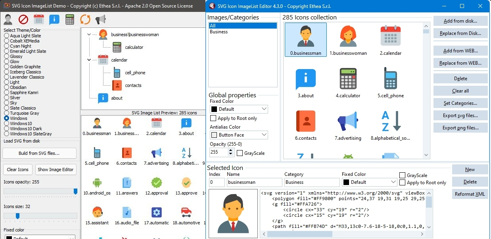

# SVGIconImageList 

## Four engines to render SVG (Delphi Image32, Delphi TSVG, Direct2D wrapper or Cairo wrapper) and four components to simplify use of SVG images (resize, fixedcolor, grayscale...)

### Actual official version 3.3.0 (VCL+FMX)

| Component | Description |
| - | - |
|  | **TSVGIconImageCollection** is collection of SVG Images for Delphi to provide a centralized list of images for SVGIconVirtualImageLists (only for VCL) |
|  | **TSVGIconVirtualImageList** is a special "virtual" ImageList for Delphi linked to an SVGIconImageCollection (only for VCL) to simplify use of SVG Icons (resize, opacity, grayscale and more...) |
|  | **TSVGIconImage** is an extended Image component for Delphi (VCL+FMX) to show any SVG image directly or included into a an SVGIconImageList with all functionality (stretch, opacity, grayscale and more...) |
|  | **TSVGIconImageList** is an extended ImageList for Delphi (VCL+FMX) with an embedded SVG image collection: **the VCL component is deprecated**, we recommend to use SVGIconImageCollection + SVGIconVirtualImageList also for older Delphi versions! |

## Very important notice

**TVirtualImageList** (available from D10.3) and **TSVGIconVirtualImageList** both use images from **TSVGIconImageCollection**. An important difference is that TVirtualImageList may use and create only a subset of the images in the collection, whereas TSVGIconVirtualImageList creates all images of the collection everytime it is needed (e,g. DPI change), which is slower and consumes more memory.

Although TVirtualImageList does not have the FixedColor, GrayScale and Opacity properties, these properties exist at the TSVGIconImageCollection and they would be reflected on the linked TVirtualImageList.

We advise that TSVGIconVirtualImageList should be used only for versions of Delphi before 10.3. For recent versions of Delphi the recommended combination should be **TSVGIconImageCollection + TVirtualImageList**. Don't forget also the importance of PreserveItems when you have a large ImageCollection with many linked Actions. Without setting this property to "True", everytime you add or remove an icon in the collection, you have to check and change the ImageIndex of all the Actions.

From D10.3 version, the **TSVGIconImageCollection** inherits from TCustomImageCollection, so you can also use it with the TVirtualImage component and place SVG icons into the new TControlList component (available from Delphi 10.4.2), as explained [here...](https://github.com/EtheaDev/SVGIconImageList/wiki/TControlList-with-SVGIconImageCollection)

### New in version 2.3: four SVG engines available!

There are four implementation: 

- Delphi Image32 (default): the new implementatio, using Image32 library by Angus Johnson

- Delphi TSVG: the first native Delphi code, based on Martin's work which is using GDI+

- A wrapper to the native Windows Direct2D implementation 

- A wrapper to the "Cairo" library (written in C)

You can read more details [here.](https://github.com/EtheaDev/SVGIconImageList/wiki/Choice-of-Factories)

## Performance comparison

This table shows the performance of the four rendering engines tested with SVGExplorer, using a significant amount of icons from different sets, rendered at 32x32 pixels.

Count | Icon set        |    TSVG | Image32 |    D2D |   Cairo | 
  --: | :--             |     --: |     --: |    --: |     --: | 
 997  | Font-Awesome    |   453ms |   453ms |  672ms |   516ms | 
 654  | Papirus         |   547ms |   781ms(1) |  547ms |   891ms(1) | 
5366  | Material-Design |  5031ms |  5094ms | 6531ms |  5828ms | 

As you can see, the four engines perform differently depending on the icons and their complexity, but the two native Delphi implementation are the best.

(1)Notice that Image32 and Cairo are the only engines capable of rendering blur effect (that is always slow to calculate): this is the reason of "slow" performance to render Papirus icons that contains blur effect.

### Available from Delphi XE3 to Delphi 10.4 (32bit and 64bit platforms)

Related links: https://www.embarcadero.com/ - https://learndelphi.org/

**Sample image of VCL version**

**Sample image of FMX (Windows) version**

**Sample image of the VCL SVGText-property editor**

### UTILITY

The [SVG Icon Explorer](https://github.com/EtheaDev/SVGIconImageList/wiki/SVGIconExplorer) utility is useful to explore and preview your svg image collections.

You can use [SVG Shell Extensions](https://github.com/EtheaDev/SVGShellExtensions) if you want to see your icons directly into Windows Explorer or you want to edit them using a powerful SVG Text Editor.

### DOCUMENTATION

Follow the [guide in Wiki section](https://github.com/EtheaDev/SVGIconImageList/wiki) to known how to use those components to modernize your Delphi VCL or FMX Windows applications scalable, colored and beautiful with few lines of code.

### RELEASE NOTES
13 Jan 2022: version 3.3.0 (VCL+FMX)
- Updated Image32 library to 4.0.0 version
- Added a set of playing cards svg examples
- Fixed Image32 drawing problem with "playing cards"

24 Nov 2021: version 3.2.0 (VCL+FMX)
- Component Editors uses IDE themes (light, dark...) and style
- Fixed available components into palette when working with mobile platforms

05 Nov 2021: version 3.1.1 (VCL+FMX)
- Fixed Image32 drawing problem in FMX
- Added Export to multiple png files to Component Editor

31 Oct 2021: version 3.1.0 (VCL+FMX)
- Updated Image32 library to 3.4.1 version
- Added Skia4Delphi engine (not complete)

28 Aug 2021: version 3.0.0 (VCL+FMX)
- Updated Packages for Delphi 11
- Updated some documentation (Images and Wiki)

24 Aug 2021: version 2.5.0 (VCL+FMX)
- Aligned to Image32 library ver.3.1

22 Jul 2021: version 2.4.0 (VCL+FMX)
- Updated and aligned to Image32 ver.3 library
- Added packages for Delphi 11 Alexandria

18 Jul 2021: version 2.3.1 (VCL+FMX)
- Fixed rendering files with color defined by 8 digits

17 Jul 2021: version 2.3.0 (VCL+FMX)
- Added new engine: Image32 library by Angus Johnson (VCL+FMX)
- Image32 is now the default native Delphi engine
- Added support for Android and iOS platforms (by Image32 engine)
- Added support for backward Delphi versions (from XE3)
- Added demo to compare the four engines (SVGViewer)
- Fixed rendering "centered" in SVGIconImage for Cairo engine.
- Warning: changed TSVGIconImage component ancestor from TCustomControl to TGraphicControl

18 Apr 2021: version 2.2.6 (VCL+FMX)
- Added new ApplyFixedColorToRootOnly property
- Added demo for new TControlList component (only for D10.4.2)

22 Feb 2021: version 2.2.5 (VCL+FMX)
- Added export to PNG option into Component editor

23 Jan 2021: version 2.2.4 (VCL+FMX)
- Fixed #156 Stretch for SVGIconImage
- Fixed #157 SVGIconImage gets correct image from VirtualImageList

17 Jan 2021: version 2.2.3 (VCL+FMX)
- Fixed #151 Antialiasing problems
- Fixed settings of different Width and Height into editor
- Fixed preview of icon with different Height and Width into editor

24 Dec 2020: version 2.2.2 (VCL+FMX)
- Added Width, Height and Zoom property for FMX components
- Redesigned FMX component editor
- Fixed VCL component editor

08 Dec 2020: version 2.2.1 (VCL+FMX)
- Added 64bit platforms for packages
- Minor fixes (empty except blocks)
- Fixed TSVGIconImage inherited color
- Fixed repaint for FMX version

23 Sep 2020: version 2.2.0 (VCL+FMX)
- Added "Cairo" SVG Engine
- Added AntialiasColor to perfect antialias effect
- Added ImageIndex property editor for SVGIconImage
- Added FixedColor and GrayScale to TSVGIconImage component

16 Sep 2020: version 2.1.1 (VCL) 2.1.0 (FMX)

- Fixed issues (#110, #111, #113)
- Editing SVG text in editor shows errors without losing content

04 Sep 2020: version 2.1.0 (VCL) 1.5.1 (FMX)

- Added preview for icons when loading svg files
- Fixed many issue (#81, #86, #87, #88, #91, #94, #103...)
- Refactoring parsing XML to increase performances (using XmlLite)

26 Aug 2020: version 2.0 (VCL) 1.5.0 (FMX)

- Added factory to choose engine
- Added interface to use alternative Third-party SVG engine
- Redesigned component editor to support Categories for icons
- New support for native VirtualImageList (from D10.3)
- StoreAsText icons to dfm by default (and unique mode)
- Fixed many issues (from #35 to #72)
Take care of TSVGIconVirtualImageList.Collection renamed to SVGIconVirtualImageList.ImageCollection.

17 Aug 2020: version 1.9 (VCL+FMX)

- FixedColor changed from TSVGColor to TColor
- Fixed assign FixedColor to icon in component editor
- Updated component editor to use TColorBox

13 Aug 2020: version 1.8 (VCL+FMX)

- Complete refactoring for full support of High-DPI
- New SVGIconImageCollection component
- New SVGIconVirtualImageList component
- Redesign of SVGIconImageList component and Component Editor
- Demo updated to test multi-monitor with different DPI
- Fixed issue #20: Coordinates in double (PaintTo methods)
- Fixed issue #25: Transform matrix is wrongly parsed
- Fixed issue #26: Error in CalcMartrix
- Fixed issue #27: TSVGRadialGradient.ReadIn does not read the gradientTransform matrix
- Fixed issue #28: Colors should be reversed in TSVGRadialGradient
- Fixed issue #29: Scaling should be based on ViewBox width/height
- Fixed issue #31: Empty svg properties cause exceptions
- Fixed issue #33: "fill-rule' presentation attribute is not processed
- Fixed issue #34: Exception text elements cause exceptions

05 Aug 2020: version 1.7 (VCL+FMX)

- Added DPIChanged method
- Enhanced SVGExplorer
- Fixed issue #20: replaced Double with Single
- Fixed issue #19 and 18#: Load/SaveToStream inefficient and encoding inconsistency
- Fixed issue #17: Wrong conversion from pt to px
- Fixed issue #14: scaling problem
- Fixed issue #11: Incompatible with Drag-Drop of TImageList
- Fixed issue #6: Rendering of some SVG images is incorrect

15 July 2020: version 1.6 (VCL+FMX)

- Fixed rendering on TButton! (VCL)
- Fixed "Apply" into ImageEditor (VCL)
- Added reformat XML to ImageEditor (VCL)
- Added utility to explore icons into disk/folder (SVGExplorer)
- Fixed inherited color drawing (SVG)
- Fixed storing properties into dfm in binary mode (VCL)
- Fixed storing for some properties (don't store default values)

13 June 2020: versione 1.5 (VCL+FMX)

- Added support for DisabledGrayScale and DisabledOpacity as in VirtualImageList
- Fixed drawing disabled icons also with VCLStyles active

09 June 2020: versione 1.4 (VCL+FMX)

- Added GrayScale and FixedColor to ImageList for every Icons
- Added GrayScale and FixedColor for single Icon
- Added some complex svg demo images
- Updated demos

06 June 2020: version 1.3 (VCL+FMX)

- Added property editor for TSVGIconImage.SVGText and TSVGIconItem.SVGText
- Fixed some drawing problems with transform attribute
- Fixed rescaling icons when monitor DPI changes

28 May 2020: version 1.2 (VCL+FMX)

- Complete support of **Delphi 10.4**
- Added support for other Delphi versions (VCL): **DXE6**, **DXE8**, **D10.1**
- Added position memory of component editor
- Fixed Issue: Icon Editor not keeping added icons
- Fixed Issue: SVG with exponent notation does not parse correctly and affects image display

25 May 2020: version 1.1 (VCL+FMX)

- Added the component **TSVGIconImageListFMX** with advanced component editor.
- Added the component **TSVGIconImageFMX** to show SVG into a TImage.
- Demos to show how they works.
- Very high performance for building hundreds of icons.

24 May 2020: first version 1.0 (VCL)

- Added the component **TSVGIconImageList** with advanced component editor.
- Added the component **TSVGIconImage** to show SVG into a TImage.
- Demos to show how they works.
- Very high performance for building hundreds of icons.
- Support from Delphi 10.2 to 10.4 Sydney (other Delphi versions coming soon)

### THANKS TO

These components use the followin libraries:

- SVG library by Martin Walter (Original version (c) 2005, 2008) with license:  
  Use of this file is permitted for commercial and non-commercial. Use, as long as the author is credited.  
  home page: <http://www.mwcs.de>  email: martin.walter@mwcs.de  
  This library is included in the svg folder of this project.
- Cairo Delphi headers by [Henri Gourvest](https://github.com/kobi1970/delphignomevectorgraphic)
  These files are included in the cairo folder of this project.
- Cairo librsvg dlls by [DJMaster](http://www.djmaster.com/)
  These files are included in the cairo/dlls folder of this project.
- Image32 library by [Angus Johnson](http://www.angusj.com/delphi/image32/Docs/_Body.htm)
  These files are included in the Image32/Source and Image32/source/Image32_SVG folders

Many thanks to **Vincent Parrett** and **Kiriakos Vlahos** for their great contibution.

**TSVGIconImageList** and **TSVGIconImage** are similar to **TSVGImageList** and **TSVGImage** included into project: [https://github.com/ekot1/DelphiSVG.git](https://github.com/ekot1/DelphiSVG.git)
but those versions are more efficient in performances, with many fixes added, plus some features like SVGText property, store icons in Text format into dfm, GrayScale and FixedColor, VirtualImageList support and more...

**TSVGIconImageListFMX** and **TSVGIconImageFMX** are similar to **TIconFontsImageListFMX** and **TIconFontsImage** included into similar project made by Ethea for Icon Fonts: [https://github.com/EtheaDev/IconFontsImageList](https://github.com/EtheaDev/IconFontsImageList)
