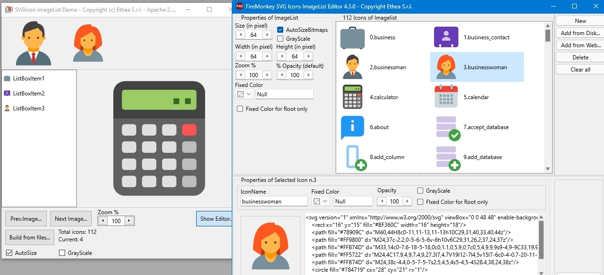

# SVGIconImageList 

## Three engines to render SVG (Delphi Image32, Skia4Delphi, Direct2D wrapper) and four components to simplify use of SVG images (resize, fixedcolor, grayscale...)

### Actual official version 4.1.5 (VCL+FMX)

| Component | Description |
| - | - |
|  | **TSVGIconImageCollection** is collection of SVG Images for Delphi to provide a centralized list of images for SVGIconVirtualImageLists (only for VCL) |
|  | **TSVGIconVirtualImageList** is a special "virtual" ImageList for Delphi linked to an SVGIconImageCollection (only for VCL) to simplify use of SVG Icons (resize, opacity, grayscale and more...) |
|  | **TSVGIconImage** is an extended Image component for Delphi (VCL+FMX) to show any SVG image directly or included into a an SVGIconImageList with all functionality (stretch, opacity, grayscale and more...) |
|  | **TSVGIconImageList** is an extended ImageList for Delphi (VCL+FMX) with an embedded SVG image collection: **the VCL component is deprecated**, we recommend to use SVGIconImageCollection + SVGIconVirtualImageList also for older Delphi versions! |

## Very important notice

WARNING: From version 4.0, **TSVGIconVirtualImageList** inherits from **TVirtualImageList** (using Delphi 10.3 to latest). For previous Delphi versions **TSVGIconVirtualImageList** inherits from **TSVGIconImageListBase**.

An important difference is that a TVirtualImageList may use and create only a subset of the images in the collection.

Although, the standard TVirtualImageList does not have the FixedColor, GrayScale, ApplyToRootOnly and Opacity properties, these properties exist at the TSVGIconImageCollection and they would be reflected on the linked TVirtualImageList, but if you change those properties at collection level, all the VirtualImageList linked changes!

For this reasons, now TSVGIconVirtualImageList have also FixedColor, GrayScale, ApplyToRootOnly and Opacity properties, so you can setup those properties only at VirtualImageList level, and you can share the same TSVGIconImageCollection from many VirtualImageList with different poperties, as you can see in the new SVGIconVirtualImageListDemo.

So, if you are using those components from Delphi 10.3, the recommended combination should be **TSVGIconImageCollection + TSVGIconVirtualImageList**.

Don't forget also the importance of PreserveItems when you have a large ImageCollection with many linked Actions. Without setting this property to "True", everytime you add or remove an icon in the collection, you have to check and change the ImageIndex of all the Actions.

Another feature available from Delphi 10.4 version, is that **TSVGIconImageCollection** inherits from TCustomImageCollection, so you can also use it with the TVirtualImage component and place SVG icons into the TControlList component, as explained [here...](https://github.com/EtheaDev/SVGIconImageList/wiki/TControlList-with-SVGIconImageCollection)

## Choose your preferred SVG engine!

There are three implementation:

- **Native Delphi Image32** (default), uses Image32 library by Angus Johnson

- Using **Skia4Delphi** library, a cross-platform 2D graphics API based on Google's Skia Graphics Library

- A wrapper to the native Windows **Direct2D** implementation

You can read more details [here.](https://github.com/EtheaDev/SVGIconImageList/wiki/Choice-of-Factories)

## Performance comparison

This table shows the performance of the three rendering engines tested with SVGExplorer, using a significant amount of icons from different sets, rendered at 128x128 pixels.

Count | Icon set        | Image32 |    D2D |Skia4Delphi|
  --: | :--             |     --: |    --: |     --:   |
 997  | Font-Awesome    |  1265ms | 1453ms |  1172ms   |
 654  | Papirus         |  2750ms(1) |  937ms | 1266ms(1) |
5366  | Material-Design | 11015ms | 12001ms | 10688ms   |

As you can see, the three engines perform differently depending on the icons and their complexity.

(1)Notice that Image32 and Skia4Delphi are the only engines capable of rendering blur effect (that is always slow to calculate): this is the reason of "slow" performance to render Papirus icons that contains blur effect.

### Available from Delphi XE3 to Delphi 12 (VCL and FMX Platforms)

Related links: [embarcadero.com](https://www.embarcadero.com) - [learndelphi.org](https://learndelphi.org)

**Sample image of VCL version**

**Sample image of FMX (Windows) version**

**Sample images of the VCL SVGText-property editor (VCL and FMX)**

### UTILITIES

The [SVG Viewer Demo](https://github.com/EtheaDev/SVGIconImageList/wiki/SVG-Viewer-(VCL)) is useful to check the rendering quality of the engines available.

The [SVG Icon Explorer](https://github.com/EtheaDev/SVGIconImageList/wiki/SVGIconExplorer) utility is useful to explore and preview your svg image collections.

You can use [SVG Shell Extensions](https://github.com/EtheaDev/SVGShellExtensions) if you want to see your icons directly into Windows Explorer or you want to edit them using a powerful **SVG Text Editor**.

### DOCUMENTATION

Follow the [guide in Wiki section](https://github.com/EtheaDev/SVGIconImageList/wiki) to known how to use those components to modernize your Delphi VCL or FMX Windows applications scalable, colored and beautiful with few lines of code.

### Other similar library

A similar project made by Ethea for Icon Fonts: [https://github.com/EtheaDev/IconFontsImageList](https://github.com/EtheaDev/IconFontsImageList)

### RELEASE NOTES
22 May 2024: version 4.1.5 (VCL+FMX)
- Fixed TSVGIconImageListBase.Assign
- Fixed TSVGIconImageCollection registration for FMX projects
- Aligned to Image32 version of 14 May 2024

05 May 2024: version 4.1.4 (VCL+FMX)
- Aligned To latest Image32 ver. 4.4

19 Apr 2024: version 4.1.3 (VCL+FMX)
- Aligned To latest Image32
- Fixed compilation with MacOSX
- Added support for Delphi 12.1

08 Jan 2024: version 4.1.2 (VCL+FMX)
- Aligned To latest Image32
- Added copy SVG to Clipboard into "Export to png" dialog
- Updated Copyrights

09 Nov 2023: version 4.1.1 (VCL+FMX)
- Aligned To Skia4Delphi 6.0.0
- Added FMX Components to all platform
- Fixed Demos for Delphi 12
- Added SvgDisableEngineHint option

03 Sep 2023: version 4.1.0 (VCL+FMX)
- Aligned Image32 Library released on 03/09/2023
- Fixed demo (removed "obsolete" SVGColor uses)
- Added support for Delphi 12.1

24 Aug 2023: version 4.0.0 (VCL+FMX)
- Removed old "native" engine TSVG
- Updated to Skia4Delphi ver. 6.0.0
- TSVGIconVirtualImageList inherits from TVirtualImageList (from D10.3 to actual version).
- Added SVGIconVirtualImageListDemo to test multiple TSVGIconVirtualImageList in same form
- Added support for Delphi 12

28 Feb 2023: version 3.9.6 (VCL+FMX)
- Updated to Image32 ver. 4.4 (30 Jan 2023)
- Updated to Skia4Delphi ver. 4.1.1 (26 Feb 2023)

13 Jan 2023: version 3.9.5 (VCL+FMX)
- Updated Copyright 2023
- Updated to Image32 ver. 4.3 (27 Sep 2022)
- Updated to Skia4Delphi ver. 4.0.2

23 Oct 2022: version 3.9.4 (VCL+FMX)
- FMX Component editor: changed selection for fixed color
- Updated to Image32 ver. 4.3 (27 Sep 2022)

15 Sep 2022: version 3.9.3 (VCL+FMX)
- Removed W11 Styles from Demo (available in Delphi only by Get-it)
- Updated D11 packages to Delphi 11.2

28 Aug 2022: version 3.9.2 (VCL+FMX)
- Fixed #240 TSVGGraphic.Assign
- Updated to Image32 ver. 4.2 (28 July 2022)
- Updated to Skia4Delphi 3.4.1 library
- Fixed #241 Alignment from Source and Destination Items (FMX)

21 Jun 2022: version 3.9.1 (VCL+FMX)
- Added support for other Delphi versions (VCL): D10 Seattle

08 May 2022: version 3.8.3 (VCL+FMX)
- Updated to Skia4Delphi 3.4.0 library
- SVGExplorer example moved under "Demo" folder

10 Apr 2022: version 3.8.2 (VCL+FMX)
- Updated to Skia4Delphi 3.3.1 llibrary
- Updated to Image32 4.11 library

29 Mar 2022: version 3.8.1 (VCL+FMX)
- Fixed Aspect-Ratio for Skia engine
- Updated SVGViewer
- Updated Demos
- Alignment to latest Skia4Delphi version

17 Mar 2022: version 3.8.0 (VCL+FMX)
- Support for Delphi 11.1
- Updated Library suffix for Delphi 10.4 and 11 to (auto)

09 Mar 2022: version 3.7.0 (VCL+FMX)
- Support for Skia4Delphi 3.2.0 completed
- Removed support for Cairo Engine
- Fixed rendering with Image32

28 Feb 2022: version 3.6.0 (VCL + FMX)
- Support for Skia4Delphi also in FMX platforms

26 Feb 2022: version 3.5.2 (VCL+FMX)
- Fixed rendering with FMX-Image32

23 Feb 2022: version 3.5.1 (VCL+FMX)
- Updated Image32 Library to 4.1.0 version
- Updated support to Skia4Delphi 3.1.0

19 Feb 2022: version 3.5.0 (VCL+FMX)
- Updated Image32 Library to 4.0.2 version
- Updated support to Skia4Delphi 3.0.3
- Fixed SVGText Editor
- Fixed some Skia4Delphi SVG rendering

14 Feb 2022: version 3.4.0 (VCL+FMX)
- Updated Image32 Library to 4.0.1 version
- Added support to Skia4Delphi 3.0
- Fixed some Image32 drawing problem

13 Jan 2022: version 3.3.0 (VCL+FMX)
- Updated Image32 library to 4.0.0 version
- Added a set of playing cards svg examples
- Fixed Image32 drawing problem with "playing cards"

24 Nov 2021: version 3.2.0 (VCL+FMX)
- Component Editors uses IDE themes (light, dark...) and style
- Fixed available components into palette when working with mobile platforms

05 Nov 2021: version 3.1.1 (VCL+FMX)
- Fixed Image32 drawing problem in FMX
- Added Export to multiple png files to Component Editor

31 Oct 2021: version 3.1.0 (VCL+FMX)
- Updated Image32 library to 3.4.1 version
- Added Skia4Delphi engine (not complete)

28 Aug 2021: version 3.0.0 (VCL+FMX)
- Updated Packages for Delphi 11
- Updated some documentation (Images and Wiki)

24 Aug 2021: version 2.5.0 (VCL+FMX)
- Aligned to Image32 library ver.3.1

22 Jul 2021: version 2.4.0 (VCL+FMX)
- Updated and aligned to Image32 ver.3 library
- Added packages for Delphi 11 Alexandria

18 Jul 2021: version 2.3.1 (VCL+FMX)
- Fixed rendering files with color defined by 8 digits

17 Jul 2021: version 2.3.0 (VCL+FMX)
- Added new engine: Image32 library by Angus Johnson (VCL+FMX)
- Image32 is now the default native Delphi engine
- Added support for Android and iOS platforms (by Image32 engine)
- Added support for backward Delphi versions (from XE3)
- Added demo to compare the four engines (SVGViewer)
- Fixed rendering "centered" in SVGIconImage for Cairo engine.
- Warning: changed TSVGIconImage component ancestor from TCustomControl to TGraphicControl

18 Apr 2021: version 2.2.6 (VCL+FMX)
- Added new ApplyFixedColorToRootOnly property
- Added demo for new TControlList component (only for D10.4.2)

22 Feb 2021: version 2.2.5 (VCL+FMX)
- Added export to PNG option into Component editor

23 Jan 2021: version 2.2.4 (VCL+FMX)
- Fixed #156 Stretch for SVGIconImage
- Fixed #157 SVGIconImage gets correct image from VirtualImageList

17 Jan 2021: version 2.2.3 (VCL+FMX)
- Fixed #151 Antialiasing problems
- Fixed settings of different Width and Height into editor
- Fixed preview of icon with different Height and Width into editor

24 Dec 2020: version 2.2.2 (VCL+FMX)
- Added Width, Height and Zoom property for FMX components
- Redesigned FMX component editor
- Fixed VCL component editor

08 Dec 2020: version 2.2.1 (VCL+FMX)
- Added 64bit platforms for packages
- Minor fixes (empty except blocks)
- Fixed TSVGIconImage inherited color
- Fixed repaint for FMX version

23 Sep 2020: version 2.2.0 (VCL+FMX)
- Added "Cairo" SVG Engine
- Added AntialiasColor to perfect antialias effect
- Added ImageIndex property editor for SVGIconImage
- Added FixedColor and GrayScale to TSVGIconImage component

16 Sep 2020: version 2.1.1 (VCL) 2.1.0 (FMX)

- Fixed issues (#110, #111, #113)
- Editing SVG text in editor shows errors without losing content

04 Sep 2020: version 2.1.0 (VCL) 1.5.1 (FMX)

- Added preview for icons when loading svg files
- Fixed many issue (#81, #86, #87, #88, #91, #94, #103...)
- Refactoring parsing XML to increase performances (using XmlLite)

26 Aug 2020: version 2.0 (VCL) 1.5.0 (FMX)

- Added factory to choose engine
- Added interface to use alternative Third-party SVG engine
- Redesigned component editor to support Categories for icons
- New support for native VirtualImageList (from D10.3)
- StoreAsText icons to dfm by default (and unique mode)
- Fixed many issues (from #35 to #72)
Take care of TSVGIconVirtualImageList.Collection renamed to SVGIconVirtualImageList.ImageCollection.

17 Aug 2020: version 1.9 (VCL+FMX)

- FixedColor changed from TSVGColor to TColor
- Fixed assign FixedColor to icon in component editor
- Updated component editor to use TColorBox

13 Aug 2020: version 1.8 (VCL+FMX)

- Complete refactoring for full support of High-DPI
- New SVGIconImageCollection component
- New SVGIconVirtualImageList component
- Redesign of SVGIconImageList component and Component Editor
- Demo updated to test multi-monitor with different DPI
- Fixed issue #20: Coordinates in double (PaintTo methods)
- Fixed issue #25: Transform matrix is wrongly parsed
- Fixed issue #26: Error in CalcMartrix
- Fixed issue #27: TSVGRadialGradient.ReadIn does not read the gradientTransform matrix
- Fixed issue #28: Colors should be reversed in TSVGRadialGradient
- Fixed issue #29: Scaling should be based on ViewBox width/height
- Fixed issue #31: Empty svg properties cause exceptions
- Fixed issue #33: "fill-rule' presentation attribute is not processed
- Fixed issue #34: Exception text elements cause exceptions

05 Aug 2020: version 1.7 (VCL+FMX)

- Added DPIChanged method
- Enhanced SVGExplorer
- Fixed issue #20: replaced Double with Single
- Fixed issue #19 and 18#: Load/SaveToStream inefficient and encoding inconsistency
- Fixed issue #17: Wrong conversion from pt to px
- Fixed issue #14: scaling problem
- Fixed issue #11: Incompatible with Drag-Drop of TImageList
- Fixed issue #6: Rendering of some SVG images is incorrect

15 July 2020: version 1.6 (VCL+FMX)

- Fixed rendering on TButton! (VCL)
- Fixed "Apply" into ImageEditor (VCL)
- Added reformat XML to ImageEditor (VCL)
- Added utility to explore icons into disk/folder (SVGExplorer)
- Fixed inherited color drawing (SVG)
- Fixed storing properties into dfm in binary mode (VCL)
- Fixed storing for some properties (don't store default values)

13 June 2020: versione 1.5 (VCL+FMX)

- Added support for DisabledGrayScale and DisabledOpacity as in VirtualImageList
- Fixed drawing disabled icons also with VCLStyles active

09 June 2020: versione 1.4 (VCL+FMX)

- Added GrayScale and FixedColor to ImageList for every Icons
- Added GrayScale and FixedColor for single Icon
- Added some complex svg demo images
- Updated demos

06 June 2020: version 1.3 (VCL+FMX)

- Added property editor for TSVGIconImage.SVGText and TSVGIconItem.SVGText
- Fixed some drawing problems with transform attribute
- Fixed rescaling icons when monitor DPI changes

28 May 2020: version 1.2 (VCL+FMX)

- Complete support of Delphi 10.4
- Added support for other Delphi versions (VCL): DXE6, DXE8, D10.1
- Added position memory of component editor
- Fixed Issue: Icon Editor not keeping added icons
- Fixed Issue: SVG with exponent notation does not parse correctly and affects image display

25 May 2020: version 1.1 (VCL+FMX)

- Added the component TSVGIconImageListFMX with advanced component editor.
- Added the component TSVGIconImageFMX to show SVG into a TImage.
- Demos to show how they works.
- Very high performance for building hundreds of icons.

24 May 2020: first version 1.0 (VCL)

- Added the component TSVGIconImageList with advanced component editor.
- Added the component TSVGIconImage to show SVG into a TImage.
- Demos to show how they works.
- Very high performance for building hundreds of icons.
- Support from Delphi 10.2 to 10.4 Sydney (other Delphi versions coming soon)

### THANKS TO

These components uses the followin libraries:

- Image32 library by [Angus Johnson](https://angusj.com/image32/Docs/_Body.htm)

  These files are included in the Image32/Source and Image32/source/Image32_SVG folders

  Copyright [Boost Software License Version 1](https://www.boost.org/LICENSE_1_0.txt)

- Skia4Delphi Library by [the autohors](https://skia4delphi.org/)

  These files are included in the Skia4Delphi/Source folder

  Copyright [MIT-License](https://github.com/skia4delphi/skia4delphi?tab=MIT-1-ov-file)

Many thanks to **Vincent Parrett** and **Kiriakos Vlahos** for their great contibution.
